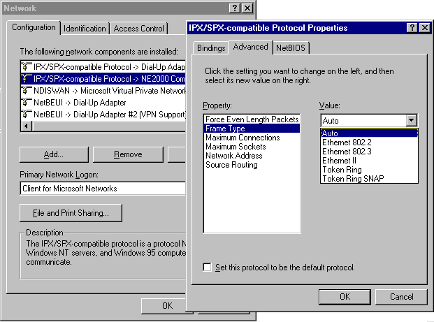
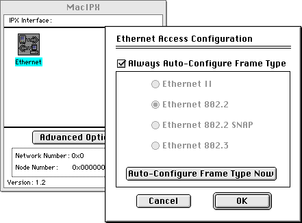

`ipxbox` by default just acts as a forwarding server between DOSbox clients,
but it can be configured to bridge to a real network. What this means is
that any clients connected to the server will also be connected to that
network - similar to a VPN (unlike a VPN, it's not granting complete access
to your entire network, only to things that use the IPX protocol, and nowadays
few things do). If you have retro computers you can use this as a method to
play online with other people, by having them connect to your `ipxbox` server.

**First, a word of warning**: DOSBox's IPX protocol is completely insecure.
There's no encryption or authentication supported. For this reason, by default
ipxbox blocks the IPX sockets associated with Windows file sharing. There's not
a lot of damage you can do with the IPX protocol nowadays but there's still the
possibility that if you use this on a public server, you might be exposing
something on your network that you don't intend to.

There are two ways to set things up: `ipxbox` can either create a
[TAP device](https://en.wikipedia.org/wiki/TUN/TAP) or use
[`libpcap`](https://en.wikipedia.org/wiki/Pcap)
to connect to a real Ethernet device. If you don't know what this means,
you'll want to use the `libpcap` approach.

## Bridging with libpcap

Find out which Ethernet interface (network card) you want to use by using the
Linux `ifconfig` command. Usually the interface will be named something like
`eth0` but it can vary sometimes.

Programs don't usually have the permission to do raw network access. On Linux
you can grant it to the `ipxbox` binary with the following command:
```
sudo setcap cap_net_raw,cap_net_admin=eip ./ipxbox
```
On other systems (BSD, etc.) only the `root` user can access raw sockets.

Next run `ipxbox` with the `--bridge` argument, eg.
```
./ipxbox --port=10000 --bridge=pcap:eth0
```
If working correctly, clients connecting to the server will now be bridged to
`eth0`. You can test this using `tcpdump` to listen for IPX packets and
checking if you see any when a client is connected.
```
$ sudo tcpdump -nli eth0 ipx
tcpdump: verbose output suppressed, use -v or -vv for full protocol decode
listening on eth0, link-type EN10MB (Ethernet), capture size 262144 bytes
05:08:38.891724 IPX 00000000.02:cf:0d:86:54:e5.0002 > 00000000.02:ff:ff:ff:00:00.0002: ipx-#2 0
05:08:43.886672 IPX 00000000.02:cf:0d:86:54:e5.0002 > 00000000.02:ff:ff:ff:00:00.0002: ipx-#2 0
05:08:47.890883 IPX 00000000.02:cf:0d:86:54:e5.4002 > 00000000.ff:ff:ff:ff:ff:ff.6590: ipx-#6590 16
05:08:48.529183 IPX 00000000.02:cf:0d:86:54:e5.4002 > 00000000.ff:ff:ff:ff:ff:ff.6590: ipx-#6590 16
05:08:48.888311 IPX 00000000.02:cf:0d:86:54:e5.0002 > 00000000.02:ff:ff:ff:00:00.0002: ipx-#2 0
```

## Using a TAP device

To use TAP instead of pcap, specify `--bridge=tap` instead. For example:
```
./ipxbox --bridge=tap
```
creates a new network device while the server is running:
```
$ ifconfig -a
tap0: flags=4098<BROADCAST,MULTICAST>  mtu 1500
        ether 9e:db:a8:4b:d2:19  txqueuelen 1000  (Ethernet)
        RX packets 0  bytes 0 (0.0 B)
        RX errors 0  dropped 0  overruns 0  frame 0
        TX packets 0  bytes 0 (0.0 B)
        TX errors 0  dropped 0 overruns 0  carrier 0  collisions 0
```
Note that the TAP device will be down by default and you will need to bring
it up yourself with `ifconfig tap0 up`.

You can also specify the name; for example:
```
./ipxbox --bridge=tap:blerg
```
produces:
```
$ ifconfig -a
blerg: flags=4098<BROADCAST,MULTICAST>  mtu 1500
        ether 16:91:8d:c6:d1:4c  txqueuelen 1000  (Ethernet)
        RX packets 0  bytes 0 (0.0 B)
        RX errors 0  dropped 0  overruns 0  frame 0
        TX packets 0  bytes 0 (0.0 B)
        TX errors 0  dropped 0 overruns 0  carrier 0  collisions 0
```
## Configuring frame type

After following the above instructions you might find problems getting a
retro computer to talk to DOSBox clients. The usual symptom will be that
DOSBox clients will be able to see network traffic from the retro machine
but not vice versa. This is most likely caused by a mismatch in
*frame type* configuration.

Put simply, when IPX packets are transmitted on a LAN there are four
different ways that they can be represented. It is important that all
machines on the network are using the same setting (or to use a metaphor,
they must all "talk the same language"). Different operating systems and
network stacks have different defaults, and the default can even vary between
versions. If the machines aren't talking to each other, this should be
the first thing to check.

### ipxbox

`ipxbox` itself by default uses IEEE 802.2 LLC framing, but the framing
format can be changed by using the `--ethernet_framing` command line flag.
For example:
```
./ipxbox --port=10000 --bridge=pcap:eth0 --ethernet_framing=eth-ii
```

| `--ethernet_framing` value | Description | Notes |
| ------------ | ----------- | ----- |
| `802.2` | IEEE 802.3 with [802.2 LLC header](https://en.wikipedia.org/wiki/IEEE_802.2) | ipxbox default, default for Novell Netware from v4.10 onwards  |
| `802.3raw` | [Novell raw IEEE 802.3](https://en.wikipedia.org/wiki/Ethernet_frame#Novell_raw_IEEE_802.3) | Older Novell Netware default until Netware v4.10 |
| `snap` | [IEEE 802.3 with 802.2 LLC and SNAP headers](https://en.wikipedia.org/wiki/Subnetwork_Access_Protocol) | |
| `eth-ii` | [Ethernet II](https://en.wikipedia.org/wiki/Ethernet_frame#Ethernet_II) | Most common framing format on modern LANs |

### Novell stack

The Novell stack is common to use under DOS with drivers named `LSL.COM`
and `IPXODI.COM`. Framing is configured by editing the `NET.CFG`
configuration file. Look for the line named `FRAME`, eg.

```
Link Driver NE2000
    INT 5
    PORT 340
    FRAME Ethernet_II
```

The following table shows the valid values for the `FRAME` field:

| ipxbox name | Name used in NET.CFG | Description |
| ----------- | -------------------- | ----------- |
| `802.2` | `Ethernet_802.2` | 802.3 with 802.2 LLC header; later Netware default (v4.10 onwards) |
| `802.3raw` | `Ethernet_802.3` | Novell raw IEEE 802.3, older Netware default |
| `snap` | `Ethernet_SNAP` | 802.3 with 802.2 LLC and SNAP headers |
| `eth-ii` | `Ethernet_II` | Ethernet II |

### Packet driver IPX

If you're using [packet
drivers](https://en.wikipedia.org/wiki/PC/TCP_Packet_Driver) under DOS, you
typically need to specify command line arguments to the packet driver on
startup to configure the framing type. Check the help text or documentation
for your packet driver to see what options exist. You may also find that your
driver displays some information on startup that helps in debugging.

### Windows 9x

To configure framing under Windows 9x, go to Control Panel → Network and
find the instance of "IPX/SPX-compatible Protocol" that is bound to your
network card. Click "Properties", then the "Advanced" tab, and "Frame
Type".

&nbsp;&nbsp;&nbsp;&nbsp;&nbsp;&nbsp;&nbsp;&nbsp;&nbsp;&nbsp;&nbsp;&nbsp;


| ipxbox name | Name used in Windows 9x | Description |
| ----------- | ----------------------- | ----------- |
| `802.2` | Ethernet 802.2 | 802.3 with 802.2 LLC header |
| `802.3raw` | Ethernet 802.3 | Novell raw IEEE 802.3 |
| `eth-ii` | Ethernet II | Ethernet II |
| | Token Ring | Do not use |
| | Token Ring SNAP | Do not use |

### Classic Mac OS

Macs running Classic Mac OS (**not** OS X) can access IPX networks by using
the [MacIPX](https://www.macintoshrepository.org/615-macipx-1-2-1) system
extension that was published by Novell. This was also included with some
Mac games such as Doom and Hexen which included IPX support to allow them
to join in games with DOS machines.

To configure framing, go to Control Panels → MacIPX. Double click
"Ethernet" to open the Ethernet Access Configuration window. By default
MacIPX attempts to automatically configure framing but if you encounter
problems you can disable autodetection and manually specify it.

&nbsp;&nbsp;&nbsp;&nbsp;&nbsp;&nbsp;&nbsp;&nbsp;&nbsp;&nbsp;&nbsp;&nbsp;


| ipxbox name | Name used in MacIPX | Description |
| ----------- | ------------------- | ----------- |
| `802.2` | Ethernet 802.2 | 802.3 with 802.2 LLC header |
| `802.3raw` | Ethernet 802.3 | Novell raw IEEE 802.3 |
| `snap` | Ethernet 802.2 SNAP | 802.3 with 802.2 LLC and SNAP headers |
| `eth-ii` | Ethernet II | Ethernet II |

## Advanced topic: TCP/IP over IPX (ipxpkt)

Much DOS software that communicates over the network (particularly using the
TCP/IP protocol stack used on the Internet) uses the
[packet driver](https://en.wikipedia.org/wiki/PC/TCP_Packet_Driver) interface.
There are packet drivers available for most network cards, providing a
standard interface for sending and receiving data over the network.
Some forks of DOSbox can emulate the Novell NE2000 card, allowing such
software to be used. However, vanilla DOSbox at the time of writing does not
include this feature. Furthermore, it typically requires granting DOSbox
special permission to be able to send and receive raw network packets.

The [`ipxpkt.com`](module/ipxpkt/driver/) driver is a packet driver that
tunnels an Ethernet link over IPX packets, and ipxbox includes support for its
protocol. This allows you to use packet driver-based software from within
vanilla DOSbox; you can [see a demo video
here](https://www.youtube.com/watch?v=5VeVaFbORhI).

**First, a word of warning**: the DOSBox IPX protocol is completely insecure.
There's no encryption or authentication supported, and enabling this feature
gives a backdoor into the network where the ipxbox server is running. If you
don't understand the implications of this, don't enable this feature on a
public-facing ipxbox server.

To use this feature:

1. Install the [`libslirp-helper`](https://packages.debian.org/sid/libslirp-helper)
package (on Debian; it is available on other Linux distros too).

    - libslirp provides a connection to a simulated network without
      requiring any special permissions. Alternatively, you can bridge the
      ipxpkt packets to a real, physical network. Follow the instructions
      from the previous section about setting up an IPX bridge, but use the
      `--ipxpkt_bridge` flag instead of `--bridge`.

2. Read the warning in the paragraph above this list. Then add
`--enable_ipxpkt` to the ipxbox command line. For example:
```
./ipxbox --port=10000 --enable_ipxpkt
```
3. Start a DOSbox client and connect to the server as normal. Make sure to
mount a directory containing the [`ipxpkt.com`](ipxpkt/driver/) driver.

4. Start the packet driver as shown:
```
C:\>ipxpkt -i 0x60

Packet driver for IPX, version 11.3
Portions Copyright 1990, P. Kranenburg
Packet driver skeleton copyright 1988-93, Crynwr Software.
This program is freely copyable; source must be available; NO WARRANTY.
See the file COPYING.DOC for details; send FAX to +1-315-268-9201 for a copy.

This may take up to 30 seconds...
System: [345]86 processor, ISA bus, Two 8259s
Packet driver software interrupt is 0x60 (96)
My Ethernet address is 02:57:04:31:68:FA

C:\>
```
5. Test the connection is working correctly by trying some software that uses
the packet driver interface. The [mTCP stack](http://www.brutman.com/mTCP/)
makes for a good first step. For example:
```
C:\>set mtcpcfg=c:\mtcp\mtcp.cfg
C:\>dhcp

mTCP DHCP Client by M Brutman (mbbrutman@gmail.com) (C)opyright 2008-2020
Version: Mar  7 2020

Timeout per request: 10 seconds, Retry attempts: 3
Sending DHCP requests, Press [ESC] to abort.

DHCP request sent, attempt 1: Offer received, Acknowledged

Good news everyone!

IPADDR 192.168.128.45
NETMASK 255.255.0.0
GATEWAY 192.168.60.1
NAMESERVER 8.8.8.8
LEASE_TIME 86400 seconds

Settings written to 'c:\mtcp\mtcp.cfg'

C:\>ping 8.8.8.8

mTCP Ping by M Brutman (mbbrutman@gmail.com) (C)opyright 2009-2020
Version: Mar  7 2020

ICMP Packet payload is 32 bytes.

Packet sequence number 0 received in 45.90 ms, ttl=114
Packet sequence number 1 received in 44.20 ms, ttl=114
Packet sequence number 2 received in 41.65 ms, ttl=114
Packet sequence number 3 received in 54.40 ms, ttl=114

Packets sent: 4, Replies received: 4, Replies lost: 0
Average time for a reply: 46.53 ms (not counting lost packets)
```
