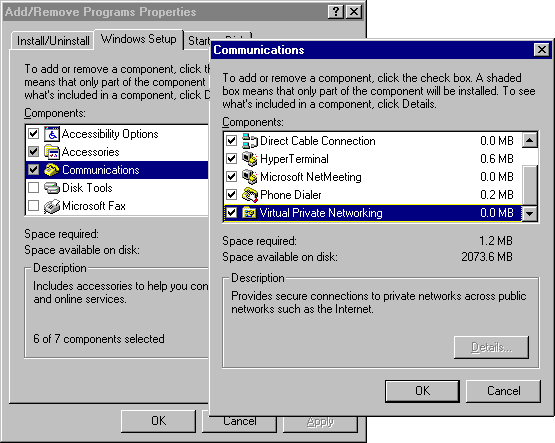
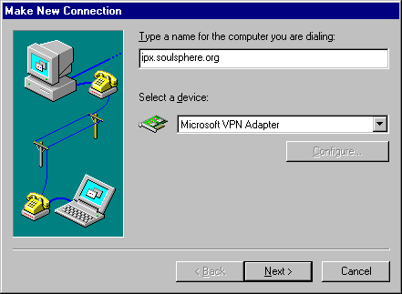
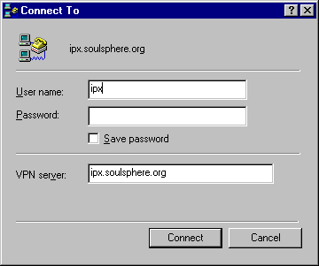
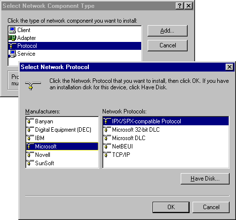

As well as allowing DOSbox connections, `ipxbox` also allows connections
using the [PPTP protocol](https://en.wikipedia.org/wiki/Point-to-Point_Tunneling_Protocol).
This is a VPN protocol that is supported natively by Windows 95, 98 and
Me. If you have a retro computer running one of these operating systems,
you can therefore use this feature to connect to a server and play with
DOSbox clients (or others using PPTP as well).

## Client setup

First check that the `ipxbox` server you're connecting to has PPTP
support enabled - by default it is disabled. If you're running your own
server, check the "Server setup" section below.

Windows 98 and Me both shipped with PPTP VPN support, but if you're
using Windows 95 you'll need to install the Dial-up Netwokring 1.4
Upgrade. This was distributed for free by Microsoft with the filename
`MSDUN14.exe`.

VPN support is an optional OS component that might not be installed on
your system. First check that it is installed by going to Control Panel
→ Add/Remove Programs → Windows Setup. Open the Communications component
and ensure that "Virtual Private Networking" is ticked.



If not installed, Windows will prompt you for the Windows install CD in
order to install it. Once installed, open "My Computer" → Dial-up
Networking and create a new connection. Select "Microsoft VPN Adapter"
as the device, and on the second page, type the host name or IP address
of the `ipxbox` server.




Now you can try out your new connection. Open it from the "Dial-up
Networking" window and you should see a dialog similar to the
following:



Check again that the VPN server address is correct, then press
"Connect". It doesn't matter what you enter in the User name and
Password fields - these aren't used. If everything is set up right, it
should connect succesfully and you will see the Dial-up Networking
window minimize to the systray (you can re-open it to disconnect).

You may see that it starts to connect but you then get disconnected by
the server. If this happens, it is possible that you don't have the IPX
protocol installed. To check, go to Control Panel → Network, and check
the list of network components.


Check that at least the following are present:

* IPX/SPX-compatible Protocol -> Dial-Up Adapter #2 (VPN support)
* IPX/SPX-compatible Protocol -> Microsoft Virtual Private Networking Adapter

If these aren't present, click "Add...". For component type, choose
"Protocol" and click "Add...". Then choose "Microsoft" as the
manufacturer and select "IPX/SPX-compatible Protocol":



Windows will prompt you for the Windows install CD in order to install
the protocol. Once installed, go back and try again to connect to the
VPN.

## Server setup

First of all, start by following the basic instructions for how to set
up an `ipxbox` server.

By default `ipxbox` only runs a DOSbox-protocol server, and PPTP is
disabled. To enable it, add `--enable_pptp` to the command line (if
running with `systemd`, make sure to update your configuration file).
For example, the command might now look like:
```
ipxbox --enable_syslog --port=10500 --enable_pptp
```
The PPTP protocol uses GRE tunneling, and sending/receiving GRE packets
requires raw sockets access. Therefore on a Linux system you will want
to grant `ipxbox` the capability it needs:
```
sudo setcap cap_net_raw,cap_net_admin=eip ./ipxbox
```
You can test the feature by having someone connect to your server. It is
better to get someone outside your network to test it, to make absolutely
sure that it is accessible to the world. If they can't connect, the
following are some ideas:

1. If the server is running on a home network, you may need to set up port
forwards. The way to do this depends on your Internet router, and
instructures vary. You need to forward TCP port 1723, along with all GRE
packets (IP protocol 47). Some routers have built-in support for PPTP
traversal, so even if there's no way to forward GRE packets, you might
find that it works anyway.

1. Check if a firewall is set up on the server where `ipxbox` is
running. If there is, you may need to add a firewall exception. Linux
firewalls use `iptables`, and the following commands are an example of
how to add an exception:
```
sudo iptables -A INPUT --dport 1723 -p tcp -j ACCEPT
sudo iptables -A INPUT -p gre -j ACCEPT
```

