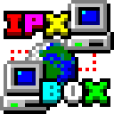

`ipxbox` is a standalone DOSBox IPX server written in Go. DOSBox clients can
connect to the server and play together.

Features:

* Sends background keepalive pings to idle clients to prevent users behind
NAT routers from being timed out.

* TUN/TAP and libpcap integration that allows the server to be bridged to a
real, physical network. This allows (emulated) dosbox users to play alongside
users on real DOS machines.

* Support for the `ipxpkt.com` packet driver protocol, allowing software that
uses the packet driver interface to get a network connection over dosbox's
built-in IPX protocol support.

* Proxying to Quake servers, so that you can make UDP-based Quake servers
appear as "local" IPX servers.

* Syslog integration for audit logging when running a public server.

For some setup instructions, see the [HOWTO](HOWTO.md).

